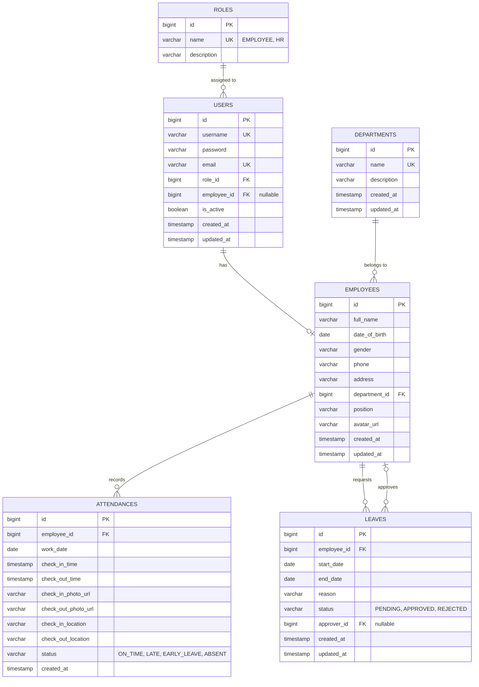

# Thiết Kế Cơ Sở Dữ Liệu (ERD) - HRM System

## Sơ đồ ERD (Entity Relationship Diagram)

## Mô tả chi tiết các bảng
- **USERS**: Lưu trữ thông tin tài khoản đăng nhập của người dùng. Mỗi user có thể liên kết với một nhân viên (`employee_id`).
- **ROLES**: Quản lý các vai trò trong hệ thống (RBAC) bao gồm EMPLOYEE, HR.
- **EMPLOYEES**: Lưu trữ thông tin chi tiết hồ sơ cá nhân của nhân viên.
- **DEPARTMENTS**: Quản lý phòng ban.
- **ATTENDANCES**: Lưu trữ dữ liệu lịch sử chấm công, bao gồm thời gian, hình ảnh selfie và tọa độ vị trí (GPS), cùng với trạng thái chấm công.
- **LEAVES**: Lưu trữ đơn xin nghỉ phép của nhân viên, quản lý quy trình duyệt đơn với `approver_id` là người duyệt.
